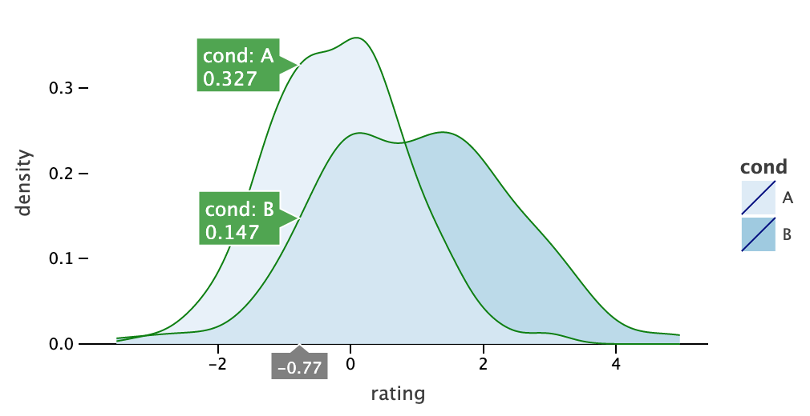

# Datalore Plot for Python

<table>
    <tr>
        <td>Latest Release</td>
        <td>
            <a href="https://pypi.org/project/datalore-plot/"/>
            
        </td>
    </tr>
    <tr>
        <td>License</td>
        <td>
            <a href="https://opensource.org/licenses/MIT"/>
            
        </td>
    </tr>
    <tr>
        <td>OS</td>
        <td>Linux, MacOS</td>
    </tr>
    <tr>
        <td>Python versions</td>
        <td>3.7, 3.8</td>
    </tr>
</table>

### Installation
```shell script
pip install datalore-plot`
```

### Quickstart in Jupyter
```python
import numpy as np
from datalore_plot import *

np.random.seed(12)
data = dict(
    cond=np.repeat(['A','B'], 200),
    rating=np.concatenate((np.random.normal(0, 1, 200), np.random.normal(1, 1.5, 200)))
)

ggplot(data, aes(x='rating', fill='cond')) + ggsize(500, 250) \
+ geom_density(color='dark_green', alpha=.7) + scale_fill_brewer(type='seq') \
+ theme(axis_line_y='blank')
````

TBD: image URL




### Overview

Datalore plot Python extension includes native backend and a Python API which was mostly borrowed from [`ggplot2`](https://ggplot2.tidyverse.org/) package well known to data-scientists who use R.

R `ggplot2` has extensive documentation and a multitude of examples and therefore is an excellent resource for those who wants to learn grammar of graphics. 

Please keep in mind however, that Python API being very similar yet is different in details from R. 

Also, please keep in mind, that despite our best efforts we did not ported 100% of R `ggplot2` API to Python on the one hand and we have added some [extras](#examples) to the API on the other.

Thankfully, there is a resource where you can try Datalore Plot live: [Datalore](https://datalore.io).

Datalore Plot is available in `Datalore` out-of-the-box and is almost identical to the one we ship as PyPI package. This is because Datalore Plot is an offshoot of the Datalore project from which it was extracted to a separate plotting library.

One important difference is that the python package in `Datalore` is named `datalore.plot` and the package you install from PyPI has name `datalore_plot`.

The advantage of [Datalore](https://datalore.io) as a learning tool in comparison to Jupyther is that it is equipped with very friendly Python editor which has auto-completion, intentions (suggestions) and other useful features.


### Examples

Unfamiliar functions used in the examples:
* `ggsize()` - sets size of the plot. Used in many examples starting from `quickstart`
* `geom_density2df()` - fills space between equal density lines on 2D density plot. Similar to `geom_density2d` but supports `fill` aesthetic.

    Example: [density_2d.ipynb](https://nbviewer.jupyter.org/github/JetBrains/datalore-plot/blob/master/docs/examples/jupyter-notebooks/density_2d.ipynb) 

* `geom_contourf()` - fills space between lines of equal level of bivariate function. Similar to `geom_contour` but supports `fill` aesthetic.

    Example: [contours.ipynb](https://nbviewer.jupyter.org/github/JetBrains/datalore-plot/blob/master/docs/examples/jupyter-notebooks/contours.ipynb) 


#### Index of example notebooks 


[quickstart.ipynb](https://nbviewer.jupyter.org/github/JetBrains/datalore-plot/blob/master/docs/examples/jupyter-notebooks/quickstart.ipynb)
: see top of the README.

[distributions.ipynb](https://nbviewer.jupyter.org/github/JetBrains/datalore-plot/blob/master/docs/examples/jupyter-notebooks/distributions.ipynb)
: histogram, density plot, box plot and facets. 
    
[error_bars.ipynb](https://nbviewer.jupyter.org/github/JetBrains/datalore-plot/blob/master/docs/examples/jupyter-notebooks/error_bars.ipynb)
: error-bars, points, lines, bars, dodge position. 

[scatter_plot.ipynb](https://nbviewer.jupyter.org/github/JetBrains/datalore-plot/blob/master/docs/examples/jupyter-notebooks/scatter_plot.ipynb)
: points, point shapes, linear regression, jitter position. 

[density_2d.ipynb](https://nbviewer.jupyter.org/github/JetBrains/datalore-plot/blob/master/docs/examples/jupyter-notebooks/density_2d.ipynb)
: points, density2d, polygons, density2df. 

[contours.ipynb](https://nbviewer.jupyter.org/github/JetBrains/datalore-plot/blob/master/docs/examples/jupyter-notebooks/contours.ipynb)
: tiles, contours, polygons, contourf. 

[legend_and_axis.ipynb](https://nbviewer.jupyter.org/github/JetBrains/datalore-plot/blob/master/docs/examples/jupyter-notebooks/legend_and_axis.ipynb)
: various presentation options. 


